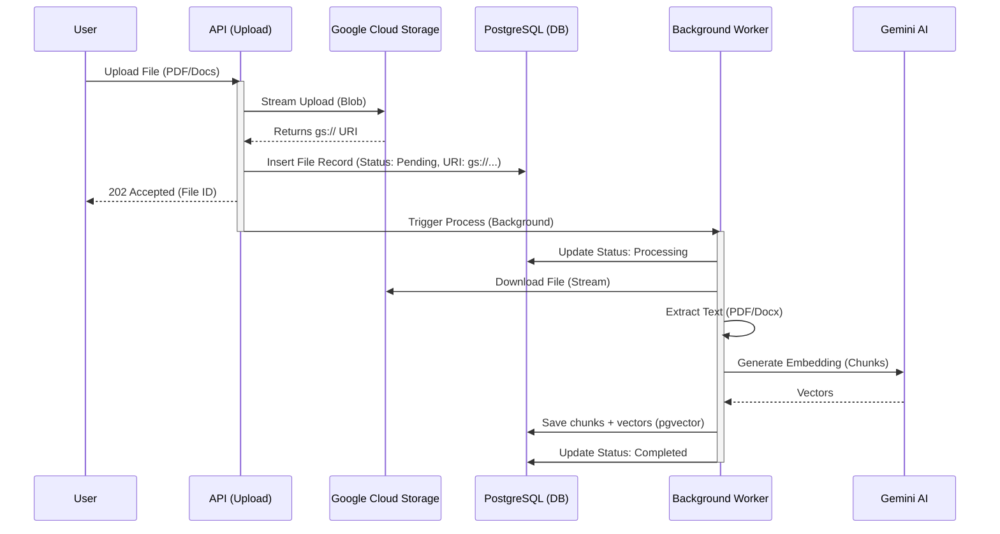

# implementation_plan.md

# Goal: Migrate File Storage to Google Cloud Storage (GCS)
**Problem**: Uploading large files (e.g., 20MB PDFs) fails because the current system tries to store the entire content in the PostgreSQL `files` table (TEXT column) or hold it in RAM. This causes 413 Payload Too Large, timeouts, or OOM crashes ("Zombie Files").
**Solution**: Direct file uploads to Google Cloud Storage (GCS). Store only the `gs://...` URI in the database. Vector processing will download from GCS asynchronously.

## User Review Required
> [!IMPORTANT]
> **Bucket Name Required**: I will assume the bucket name is `jvc-ai-kms-uploads` (based on your project ID). Please confirm if you have a specific bucket created.
> **Permission**: The Cloud Run service account must have `Storage Object Creator` and `Storage Object Viewer` roles on this bucket.

## Proposed Changes

### Backend (`api/`)

#### [MODIFY] [requirements.txt](file:///Users/mr.phariyawit/Documents/ai-support/api/requirements.txt)
- Add `google-cloud-storage>=2.14.0`

#### [MODIFY] [database.py](file:///Users/mr.phariyawit/Documents/ai-support/api/database.py)
- Update `migrate_db` to add `gcs_uri` column to `files` table.
```sql
ALTER TABLE files ADD COLUMN IF NOT EXISTS gcs_uri VARCHAR;
```

#### [MODIFY] [main.py](file:///Users/mr.phariyawit/Documents/ai-support/api/main.py)
- Update `upload_file` endpoint:
    1.  Initialize GCS Client.
    2.  Stream `file.file` directly to GCS Bucket (Blob).
    3.  Save `gcs_uri` (e.g., `gs://bucket/file_id.pdf`) in DB.
    4.  Set `File.content` to `[Stored in GCS]` placeholder.
- Update `process_file_background`:
    - Pass `gcs_uri` to Ingestion Service.

#### [MODIFY] [ingestion_service.py](file:///Users/mr.phariyawit/Documents/ai-support/api/ingestion_service.py)
- Add `download_from_gcs` method.
- Update `process_file`:
    - If `gcs_uri` is present, download file to temporary local path.
    - Extract text from local file.
    - Proceed with chunking/embedding.

### Workflow Visualization


## Verification Plan

### Automated Tests
- Mock GCS Client in `tests/test_upload.py`.
- Verify `gcs_uri` is saved in DB.

### Manual Verification
1.  **Upload 20MB PDF**: Should succeed immediately (no timeout).
2.  **Check Logs**: Verify "Uploaded to GCS: gs://..." log.
3.  **Check Analyze**: Verify `analyze_file` works (it will fetch chunks, derived from GCS content).
