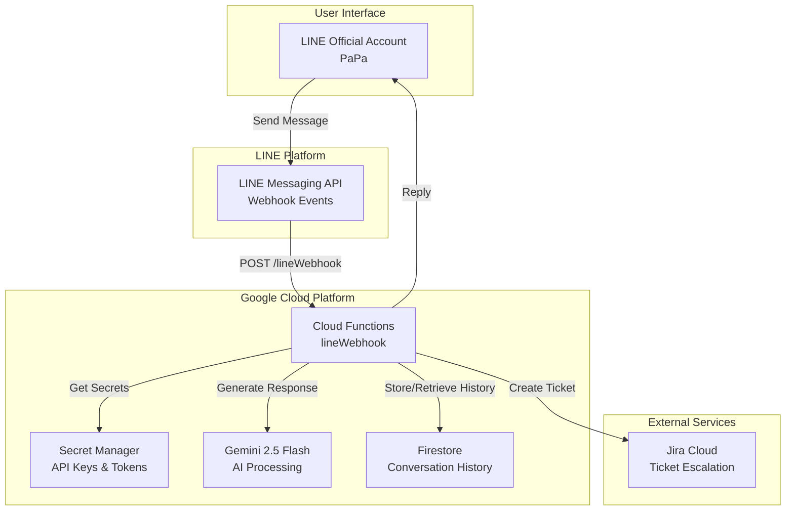
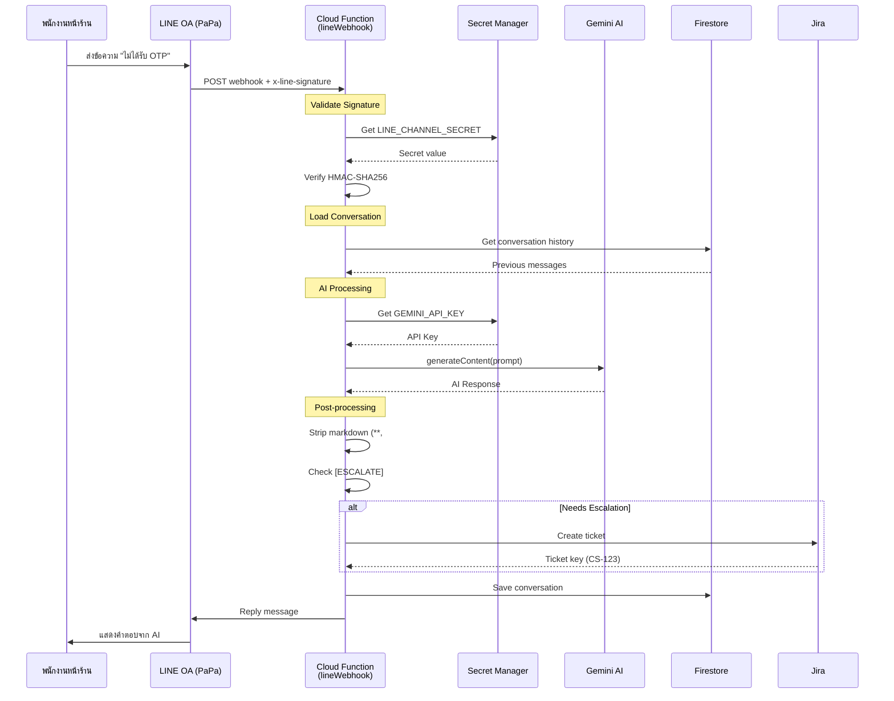
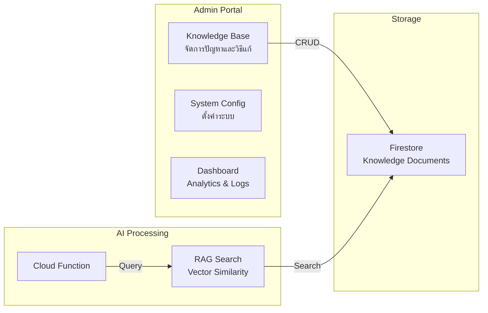

# AI Support Assistant - Technical Walkthrough

## สถานะปัจจุบัน ✅

LINE Bot ทำงานได้สมบูรณ์แล้ว!
- Signature validation ผ่าน
- AI (Gemini 2.5 Flash) ตอบกลับได้
- Markdown stripping สำหรับ LINE

---

## Tech Stack Overview

---

## Sequence Diagram - Message Flow

---

## กระบวนการทำงานโดยละเอียด

### 1. รับข้อความ (Webhook)
- LINE ส่ง POST request ไปที่ `lineWebhook` Cloud Function
- Header `x-line-signature` ใช้ verify ว่ามาจาก LINE จริง

### 2. ตรวจสอบความถูกต้อง (Signature Validation)
- ใช้ `rawBody` + `LINE_CHANNEL_SECRET`
- คำนวณ HMAC-SHA256 เปรียบเทียบกับ signature
- ปฏิเสธ request ที่ไม่ถูกต้อง

### 3. โหลดประวัติสนทนา
- ดึงข้อมูลจาก Firestore collection `support_conversations`
- ใช้ `userId` เป็น document ID

### 4. ประมวลผล AI
- สร้าง prompt รวม System Prompt + ประวัติ + คำถาม
- เรียก Gemini 2.5 Flash ผ่าน `@google/genai`
- ลบ markdown formatting (**, #, backticks)

### 5. ตรวจสอบ Escalation
- ถ้า AI ตอบ `[ESCALATE]` → สร้าง Jira ticket
- เพิ่มเลข ticket ในข้อความตอบกลับ

### 6. ตอบกลับผู้ใช้
- บันทึกประวัติลง Firestore
- ส่ง reply กลับผ่าน LINE API

---

## 💡 ควรมี Webapp จัดการ Datasource หรือไม่?

### แนะนำ: **ควรมี** สำหรับ Phase 2

### เหตุผล:

| ปัจจุบัน                        | ปัญหา                      |
| ---------------------------- | ------------------------- |
| Knowledge อยู่ใน System Prompt | ต้อง deploy ใหม่ทุกครั้งที่อัพเดท |
| ไม่มี UI จัดการ                 | IT Admin แก้ไขเองไม่ได้      |
| ไม่มี analytics                | ไม่รู้ว่าปัญหาไหนเกิดบ่อย        |

### Webapp ที่แนะนำ:

### Features แนะนำ:

1. **Knowledge Base Management**
   - เพิ่ม/แก้ไข/ลบ ปัญหาที่พบบ่อย
   - Categorize by system (JDID, SGF+, etc.)
   - Version history

2. **Analytics Dashboard**
   - ปัญหาที่ถามบ่อย
   - อัตราการ escalate
   - Response time

3. **Conversation Logs**
   - ดูประวัติการสนทนา
   - Export สำหรับ training

4. **System Settings**
   - เปลี่ยน AI parameters
   - Manage LINE OA settings

---

## สรุป

| Component            | Status                      |
| -------------------- | --------------------------- |
| LINE Webhook         | ✅ Working                   |
| Signature Validation | ✅ Fixed (secret length bug) |
| Gemini AI            | ✅ Working (2.5-flash)       |
| Markdown Stripping   | ✅ Deployed                  |
| Conversation History | ✅ Firestore                 |
| Jira Escalation      | ⚠️ Code ready, needs testing |
| Admin Webapp         | 📋 Recommended for Phase 2   |
