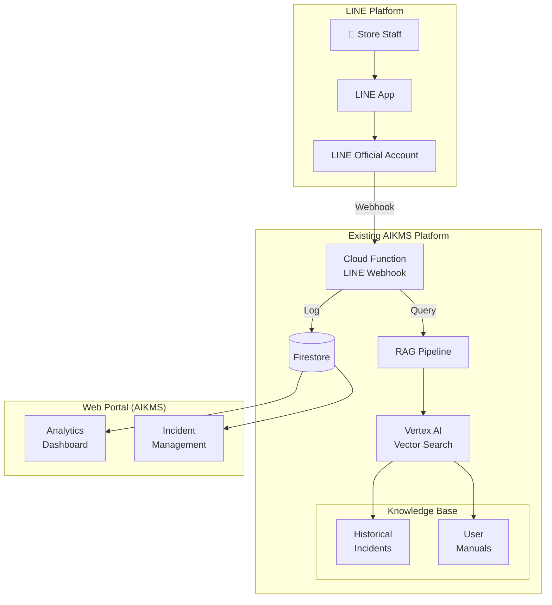
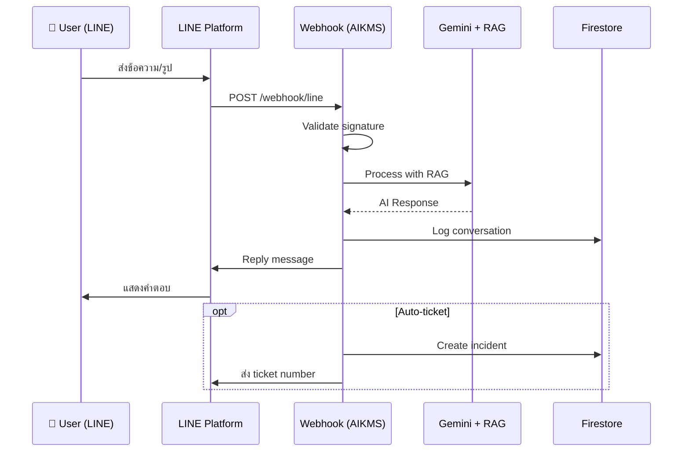

# Implementation Plan: AI-Powered IT Support Assistant

**Branch**: `001-ai-support-assistant` | **Date**: 2026-01-07 | **Spec**: [spec.md](file:///Users/mr.phariyawit/Documents/ai-support/.specify/specs/001-ai-support-assistant/spec.md)

---

## Summary

พัฒนา AI-powered IT Support Assistant โดย **integrate กับ AIKMS ที่มีอยู่แล้ว** และใช้ **LINE Official Account** เป็นช่องทางสื่อสารหลัก

### Key Changes from Previous Plan
| เดิม                              | ใหม่                            |
| -------------------------------- | ------------------------------ |
| Next.js Web Chat                 | **LINE OA Webhook**            |
| New Firebase project             | **Integrate AIKMS (existing)** |
| Build Vector Search from scratch | **Use AIKMS RAG Pipeline**     |

### Benefits
- ✅ ลดเวลา development 50% (ใช้ AIKMS infrastructure ที่มีอยู่)
- ✅ Users คุ้นเคยกับ LINE อยู่แล้ว (เดิมใช้ LINE กลุ่มต่างๆ ~70%)
- ✅ รองรับ Image upload ผ่าน LINE native

---

## Technical Context

| Aspect             | Decision                     | Rationale                                             |
| ------------------ | ---------------------------- | ----------------------------------------------------- |
| **Chat Interface** | LINE Official Account        | Users คุ้นเคย, Push notification, Image support         |
| **Webhook Server** | AIKMS Cloud Functions        | Reuse existing infrastructure                         |
| **AI/RAG**         | AIKMS Gemini + Vector Search | Already configured with Vertex AI                     |
| **Database**       | AIKMS Firestore              | Add `incidents` & `support_conversations` collections |
| **Knowledge Base** | AIKMS Vector Search          | Add IT Support documents to existing index            |
| **Web Portal**     | AIKMS React Frontend         | Add IT Support module                                 |

---

## Architecture



---

## LINE OA Integration

### Message Flow



### LINE Webhook Handler

```typescript
// functions/src/line/webhook.ts
import { onRequest } from 'firebase-functions/v2/https';
import { Client, WebhookEvent, TextMessage } from '@line/bot-sdk';
import { processITSupportMessage } from '../support/processor';

const lineClient = new Client({
  channelAccessToken: process.env.LINE_CHANNEL_ACCESS_TOKEN!,
  channelSecret: process.env.LINE_CHANNEL_SECRET!,
});

export const lineWebhook = onRequest(async (req, res) => {
  // 1. Validate signature
  const signature = req.headers['x-line-signature'];
  // ... validation logic
  
  // 2. Process events
  const events: WebhookEvent[] = req.body.events;
  
  for (const event of events) {
    if (event.type === 'message') {
      const response = await processITSupportMessage({
        userId: event.source.userId,
        message: event.message,
        replyToken: event.replyToken,
      });
      
      await lineClient.replyMessage(event.replyToken, response);
    }
  }
  
  res.status(200).send('OK');
});
```

---

## Proposed Changes to AIKMS

### Phase 1: LINE Integration (Week 1)

#### [NEW] `functions/src/line/` - LINE Webhook Handler

```
functions/src/line/
├── webhook.ts          # Main webhook handler
├── signature.ts        # LINE signature validation
├── messageHandler.ts   # Text/Image message processing
└── richMenu.ts         # Rich menu configuration
```

**Changes:**
- Add `@line/bot-sdk` dependency
- Create LINE webhook Cloud Function
- Configure environment variables (Channel Secret, Access Token)

---

#### [NEW] `functions/src/support/` - IT Support Logic

```
functions/src/support/
├── processor.ts        # Main message processor
├── classifier.ts       # Intent classification
├── ticketCreator.ts    # Auto-ticket creation
└── prompts.ts          # System prompts for IT Support
```

---

### Phase 2: Knowledge Base (Week 2)

#### [MODIFY] AIKMS Vector Search Index

**Add IT Support Documents:**
1. Import `FM-IT03-02 Incident Log (8).csv` → `incidents` collection
2. Process User Manual PDFs → `knowledge` collection
3. Create embeddings using existing AIKMS pipeline

```typescript
// Firestore structure addition
{
  "knowledge": {
    "{docId}": {
      "type": "it_support",  // NEW type
      "system": "JDID" | "JMB_CRM" | ...,
      "category": "OTP" | "Registration" | ...,
      "content": "...",
      "embedding": [...]
    }
  }
}
```

---

### Phase 3: Incident Portal (Week 3)

#### [NEW] AIKMS Frontend Module

Add IT Support section to existing AIKMS React app:

```
src/pages/
├── support/
│   ├── index.tsx           # Incident list
│   ├── [id].tsx            # Incident detail
│   ├── conversations.tsx   # Chat history view
│   └── analytics.tsx       # Dashboard
```

---

### Phase 4: Rich Menu & UX (Week 4)

#### LINE Rich Menu Design

```
┌─────────────────────────────────────┐
│  🔍 ค้นหาปัญหา  │  📋 เปิด Ticket  │
├─────────────────────────────────────┤
│  📚 คู่มือใช้งาน  │  📞 ติดต่อ IT   │
└─────────────────────────────────────┘
```

**Menu Actions:**
- ค้นหาปัญหา → Trigger AI chat mode
- เปิด Ticket → Quick form (LIFF)
- คู่มือใช้งาน → Link to User Manuals
- ติดต่อ IT → Escalate to human

---

## Data Model (Additions to AIKMS)

### New Collections

```
firestore/
├── support_conversations/
│   └── {conversationId}
│       ├── lineUserId: string
│       ├── messages: Message[]
│       ├── createdAt: timestamp
│       ├── status: 'active' | 'resolved'
│       └── incidentId?: string
│
├── support_incidents/
│   └── {incidentId}
│       ├── id: string
│       ├── source: 'line' | 'web' | 'import'
│       ├── lineUserId?: string
│       ├── system: string
│       ├── category: string
│       ├── priority: string
│       ├── description: string
│       ├── solution: string
│       ├── status: 'pending' | 'in_progress' | 'done'
│       ├── createdAt: timestamp
│       └── closedAt?: timestamp
│
└── support_users/
    └── {lineUserId}
        ├── displayName: string
        ├── department?: string
        └── lastContact: timestamp
```

---

## LINE OA & Integration Details

### LINE Official Accounts

| Account         | Purpose               | Status              |
| --------------- | --------------------- | ------------------- |
| **PaPa**        | Development & Testing | ใช้ test ก่อน         |
| **JVC Support** | Production            | Deploy หลัง test ผ่าน |

### JIRA Integration (Escalation)

**Endpoint**: `https://jventures.atlassian.net`

เมื่อ AI ไม่สามารถแก้ปัญหาได้ จะสร้าง JIRA ticket อัตโนมัติ:

```typescript
// Escalation to JIRA
async function createJiraTicket(incident: Incident) {
  const jira = new JiraClient({
    host: 'jventures.atlassian.net',
    auth: { /* API token */ }
  });
  
  return await jira.createIssue({
    project: 'CS', // Customer Support project
    issueType: 'Task',
    summary: `[${incident.system}] ${incident.category}`,
    description: incident.description,
    priority: mapPriority(incident.priority),
    labels: ['from-line-bot', incident.system]
  });
}
```

**JIRA Project Created:**
- **Name**: Customer Support
- **Key**: CS
- **URL**: https://jventures.atlassian.net/jira/software/projects/CS/boards/91

### AIKMS Reference (Read-Only)

จะอ้างอิง patterns และ code จาก AIKMS:
- RAG pipeline implementation
- Firestore collection structure
- Cloud Functions patterns
- Vertex AI Vector Search configuration

---

## Verification Plan

### Unit Tests

```bash
# Run AIKMS tests + new support module
cd functions
npm test -- --grep "support"
```

**Test Cases:**
- [ ] LINE signature validation
- [ ] Message classification
- [ ] Ticket auto-creation logic
- [ ] RAG integration

---

### Integration Tests (LINE Simulator)

1. ใช้ LINE Bot Simulator ใน LINE Developers Console
2. ส่งข้อความทดสอบ:
   - "สมัครสมาชิกไม่สำเร็จ" → ควรได้ solution
   - ส่งรูป error → ควรวิเคราะห์ได้
   - "เปิด ticket" → ควรสร้าง ticket

---

### Manual Verification

#### 1. LINE Chat Test

**Steps:**
1. เพิ่มเพื่อน LINE OA (จาก QR Code)
2. ส่งข้อความ "ไม่ได้รับ OTP"
3. ตรวจสอบว่า AI ตอบกลับพร้อมวิธีแก้ไข
4. ส่งรูป screenshot error
5. AI ควรวิเคราะห์และแนะนำ

**Expected:** ตอบกลับภายใน 3 วินาที

---

#### 2. Auto-Ticket Test

**Steps:**
1. ส่งข้อความ "เปิด ticket ปัญหา JDID ลงทะเบียนไม่ได้"
2. AI ควรสร้าง ticket และแจ้ง ticket number
3. เปิด AIKMS Portal → ตรวจสอบว่า ticket ปรากฏใน list

---

#### 3. Rich Menu Test

**Steps:**
1. กด "📚 คู่มือใช้งาน"
2. ควรแสดง list ของ manuals
3. กด "📞 ติดต่อ IT"
4. ควร escalate ไป IT Support group

---

## Timeline

| Week | Milestone                                         |
| ---- | ------------------------------------------------- |
| 1    | LINE Integration: Webhook setup, basic chat       |
| 2    | Knowledge Base: Import incidents, process manuals |
| 3    | Portal: Add IT Support module to AIKMS            |
| 4    | Polish: Rich Menu, analytics, testing             |

---

## Clarifications Needed

> [!WARNING]
> **ต้องตอบก่อนเริ่ม:**

1. **LINE OA**: มี LINE Official Account อยู่แล้วหรือต้องสร้างใหม่?
2. **AIKMS Access**: ขอให้เพิ่ม AIKMS folder เข้า workspace ได้ไหม? (เพื่อ implement)
3. **User Manual PDFs**: ต้องการ import PDFs เข้า knowledge base ด้วยหรือไม่?
4. **Escalation**: เมื่อ AI ไม่สามารถแก้ปัญหาได้ ควร forward ไปที่ใด? (LINE Group? Ticket system?)
