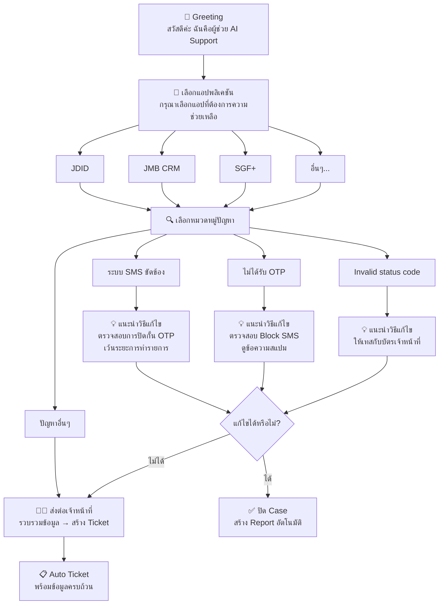

# Feature Specification: AI-Powered IT Support Assistant

**Feature Branch**: `001-ai-support-assistant`  
**Created**: 2026-01-07  
**Status**: Draft  
**Input**: Incident Log data "FM-IT03-02 Incident Log (8).csv" and User Journey documentation

---

## Executive Summary

ระบบ AI Support Assistant สำหรับช่วยเหลือทีม IT Support ในการวินิจฉัยปัญหา แนะนำแนวทางแก้ไข และช่วยลด resolution time โดยอิงจากข้อมูล Incident Log ที่มีมากกว่า 950+ cases และ User Manuals จากระบบต่างๆ

### Data Sources

| แหล่งข้อมูล                  | รายละเอียด                                                                                                 |
| ------------------------- | --------------------------------------------------------------------------------------------------------- |
| **Incident Log CSV**      | `FM-IT03-02 Incident Log (8).csv` - 955 incidents                                                         |
| **Google Spreadsheet**    | [Incident Log ที่ใฝ่ฝัน](https://docs.google.com/spreadsheets/d/1h9yKh7isb7VpZPkz9lqM5_Dk8aJ07rqjndrPZBYaAK8) |
| **User Manuals (6 PDFs)** | JDID, JMB, JAS/CASA, JOIN, ป๋า Advance                                                                     |

---

## UX Conversation Flow (จาก "ตัวอย่าง ที่ออกแบบ" Sheet)

---

## User Scenarios & Testing *(mandatory)*

### User Story 1 - การวินิจฉัยปัญหาอัตโนมัติ (Priority: P1)

ในฐานะ **IT Support Staff** ผมต้องการให้ระบบ AI สามารถวินิจฉัยปัญหาที่พนักงานหน้าร้านแจ้งเข้ามาได้อัตโนมัติ เพื่อลดเวลาในการหาแนวทางแก้ไข

**Why this priority**: ปัญหาที่แจ้งเข้ามามากที่สุดคือ JDID EKYC (~40% ของ incidents) และต้องการคำตอบที่รวดเร็วจากทีม Support

**Independent Test**: สามารถทดสอบโดยป้อนข้อความปัญหา และตรวจสอบว่า AI สามารถระบุปัญหาและแนะนำแนวทางแก้ไขได้ถูกต้อง

**Acceptance Scenarios**:

1. **Given** ผู้ใช้แจ้งปัญหา "เบอร์เคยมีการยืนยันตัวตนด้วยบัตรประชาชนอื่น", **When** AI วิเคราะห์ปัญหา, **Then** AI แนะนำให้ส่งฟอร์มยืนยันการเป็นเจ้าของเบอร์และตรวจสอบสินเชื่อ
2. **Given** ผู้ใช้แจ้งปัญหา "ขึ้น error ระบบSMS ขัดข้องกรุณาติดต่อเจ้าหน้าที่", **When** AI วิเคราะห์ปัญหา, **Then** AI แนะนำให้ตรวจสอบการปิดกั้น OTP และเว้นระยะการทำรายการ
3. **Given** ผู้ใช้แจ้งปัญหา "สมัครสมาชิกไม่สำเร็จ", **When** AI วิเคราะห์ปัญหา, **Then** AI แนะนำให้ประสานงาน J Point เพื่อตรวจสอบข้อมูล

---

### User Story 2 - การจัดหมวดหมู่ปัญหาอัตโนมัติ (Priority: P1)

ในฐานะ **IT Support Staff** ผมต้องการให้ระบบจัดหมวดหมู่ปัญหาที่แจ้งเข้ามาโดยอัตโนมัติ เพื่อให้สามารถ route ไปยังทีมที่เกี่ยวข้องได้อย่างรวดเร็ว

**Why this priority**: การจัดหมวดหมู่ช่วยลดเวลาในการ triage และส่งต่อปัญหาไปยังทีมที่เหมาะสม

**Independent Test**: ป้อนข้อความปัญหาและตรวจสอบว่าระบบจัดหมวดหมู่ได้ถูกต้องตาม Category ที่กำหนด

**Acceptance Scenarios**:

1. **Given** ปัญหาเกี่ยวกับ OTP, **When** ระบบวิเคราะห์, **Then** จัดหมวดหมู่เป็น "ปัญหาแอพ" หรือ "OTP"
2. **Given** ปัญหาเกี่ยวกับบัตรประชาชน, **When** ระบบวิเคราะห์, **Then** จัดหมวดหมู่เป็น "ปัญหาบัตรประชาชน"
3. **Given** ปัญหาเกี่ยวกับการลงทะเบียน JDID, **When** ระบบวิเคราะห์, **Then** จัดหมวดหมู่เป็น "Register JDIDeKYC"

---

### User Story 3 - การค้นหาข้อมูลจาก Knowledge Base (Priority: P2)

ในฐานะ **IT Support Staff** ผมต้องการค้นหาวิธีแก้ไขปัญหาจาก User Manual และ FAQ เพื่อให้คำตอบที่ถูกต้องแก่พนักงานหน้าร้าน

**Why this priority**: User Manuals มีข้อมูลที่ครบถ้วนแต่ต้องใช้เวลาในการค้นหา

**Independent Test**: ถามคำถามเกี่ยวกับขั้นตอนการใช้งานและตรวจสอบว่า AI ตอบได้ถูกต้องตาม User Manual

**Acceptance Scenarios**:

1. **Given** คำถาม "ขั้นตอนการลงทะเบียน JDID", **When** AI ค้นหาใน Knowledge Base, **Then** AI ตอบด้วยขั้นตอนจาก JDID User Manual
2. **Given** คำถาม "วิธีใช้งาน E-Loyalty JAS", **When** AI ค้นหา, **Then** AI ตอบด้วยข้อมูลจาก E-Loyalty Manual
3. **Given** คำถาม "วิธีเบิกเงินป๋า Advance", **When** AI ค้นหา, **Then** AI ตอบด้วยข้อมูลจากคู่มือป๋า Advance

---

### User Story 4 - การสร้าง Incident Report อัตโนมัติ (Priority: P2)

ในฐานะ **IT Support Staff** ผมต้องการให้ระบบสร้าง Incident Report อัตโนมัติจากการสนทนา เพื่อลดเวลาในการบันทึกข้อมูล

**Why this priority**: การบันทึก Incident ใช้เวลามากและมี format ที่ต้องปฏิบัติตาม

**Independent Test**: หลังจากจบการสนทนา ตรวจสอบว่าระบบสามารถสร้าง Report ที่มีข้อมูลครบถ้วน

**Acceptance Scenarios**:

1. **Given** การสนทนาเกี่ยวกับปัญหา JDID, **When** จบการสนทนา, **Then** ระบบสร้าง Report ที่มี: ปัญหา, สาเหตุ, แนวทางแก้ไข, ผลการแก้ไข
2. **Given** การสนทนามีข้อมูลลูกค้า, **When** สร้าง Report, **Then** ข้อมูลลูกค้าถูกกรอกโดยอัตโนมัติ

---

### User Story 5 - Dashboard สำหรับ Analytics (Priority: P3)

ในฐานะ **IT Support Manager** ผมต้องการ Dashboard ที่แสดงสถิติปัญหาต่างๆ เพื่อวางแผนการปรับปรุงระบบ

**Why this priority**: ข้อมูล Analytics ช่วยในการตัดสินใจเชิงกลยุทธ์แต่ไม่จำเป็นสำหรับการทำงานประจำวัน

**Independent Test**: เปิด Dashboard และตรวจสอบว่าแสดงข้อมูลสถิติที่ถูกต้อง

**Acceptance Scenarios**:

1. **Given** มีข้อมูล Incidents 30 วัน, **When** เปิด Dashboard, **Then** แสดงกราฟ Incidents by System, Category, และ Trend
2. **Given** เลือก Filter by System, **When** กรอง, **Then** Dashboard แสดงเฉพาะข้อมูลของ System ที่เลือก

---

### Edge Cases

- **ข้อมูลไม่ครบ**: ผู้ใช้แจ้งปัญหาโดยไม่ให้ข้อมูลเพียงพอ → ระบบถามข้อมูลเพิ่มเติม
- **ปัญหาใหม่**: ปัญหาที่ไม่เคยเกิดขึ้นมาก่อน → ระบบแจ้งว่าไม่พบข้อมูลและส่งต่อทีม Technical
- **หลายปัญหาพร้อมกัน**: ผู้ใช้แจ้งหลายปัญหาในข้อความเดียว → ระบบแยกและจัดการทีละปัญหา
- **ภาษาผสม**: ผู้ใช้พิมพ์ภาษาไทย-อังกฤษปนกัน → ระบบรองรับได้
- **Error Messages**: ผู้ใช้ส่งรูป Error หรือ Error Code → ระบบวิเคราะห์จาก Error Message

---

## Requirements *(mandatory)*

### Functional Requirements

#### Core AI Capabilities (จาก Chatbot Sheet)
- **FR-001**: ระบบ MUST วิเคราะห์ข้อความภาษาไทยและจำแนกประเภทปัญหาได้
- **FR-002**: ระบบ MUST แนะนำแนวทางแก้ไขอิงจาก Historical Data (950+ cases)
- **FR-003**: ระบบ MUST ค้นหาข้อมูลจาก User Manuals (6 PDFs) ได้
- **FR-004**: ระบบ MUST จดจำบริบทของการสนทนาตลอด session
- **FR-005**: ระบบ MUST รองรับการป้อนข้อมูลทั้งภาษาไทยและอังกฤษ
- **FR-006**: ระบบ MUST **รองรับการส่งรูปภาพหน้าจอ Error** และตอบกลับทันที (Image Analysis)
- **FR-007**: ระบบ MUST **เข้าใจภาษาธรรมชาติเหมือนคนจริง** (Natural Language Understanding)
- **FR-008**: ระบบ MUST **รวบรวมข้อมูลให้ครบถ้วนก่อนส่งต่อเจ้าหน้าที่** (Information Gathering)
- **FR-009**: ระบบ MUST **สร้าง Ticket อัตโนมัติ** (Auto Ticket Creation) โดยไม่ต้องกดส่ง
- **FR-010**: ระบบ MUST **ตรวจจับอารมณ์และตอบสุภาพ** (Emotion Detection) กรณีมีปัญหาเพิ่มเติม
- **FR-011**: ระบบ MUST **ระบุข้อมูลติดต่อสำหรับแอปภายนอก** ได้ถูกต้อง (เช่น SGF+ → ติดต่อ SG)

#### System Integration

- **FR-012**: ระบบ MUST รองรับ 12 ระบบหลัก:
  - JDID EKYC (digital identity verification)
  - JMB_CRM (Jaymart Mobile CRM)
  - JAS_CRM (JAS Family CRM)
  - SGF+ (SG Finance mobile app)
  - ONE ID (unified identity)
  - JOIN (crypto wallet)
  - PAH Advance (employee advance)
  - CASA_CRM (Casa Lapin CRM)
  - Baanbaan (mortgage app)
  - JAII DEE (insurance)
  - Teenoi (restaurant loyalty)
  - J Wallet (digital wallet)

- **FR-013**: ระบบ MUST จัดหมวดหมู่ตาม Category:
  - ปัญหาแอพ
  - ปัญหาบัตรประชาชน
  - ปัญหาอุปกรณ์
  - Register JDIDeKYC
  - KYC
  - OTP
  - Information
  - Change info
  - coupon
  - Seed Phrase
  - J Wallet

#### Incident Log Portal (จาก Log Sheet)

- **FR-014**: ระบบ MUST มี **ฟอร์มเปิด Ticket ด้วยตัวเอง** (Self-service portal) สำหรับลูกค้าเปิด ticket เองได้ ต้องสร้างจำนวนตามที่ต้องการ คือสามารถรับข้อมูลมาเติมเอง และมาดูที่ทำ IT ได้ใจว่า
- **FR-015**: ระบบ MUST มี **ปุ่มส่งต่อ Ticket** เมื่อเปิด Ticket แล้ว จะไปให้ผู้รับผิดชอบถัดไปได้เลย (หากแอพจะต้องเปิดเป็น Spam)
- **FR-016**: ระบบ MUST สามารถ **ดาวน์โหลด Report การแก้ไขปัญหา** ได้ (สาเหตุ, การแก้ไข, การป้องกัน) เป็น PDF/Excel
- **FR-017**: ระบบ MUST **แบ่งหมวดหมู่ปัญหาและจัดลำดับ** ตามแอปพลิเคชัน พร้อมรายงานสรุป
- **FR-018**: ระบบ MUST มี **ระบบค้นหา Case เก่า** ได้ง่าย เพื่อติดตามประวัติการให้บริการ
- **FR-019**: ระบบ MUST มี **ระบบกรอง Spam และ Ticket ซ้ำซ้อน** (Duplicate detection)
- **FR-020**: ระบบ MUST มี **ลิงก์ไปยังรายงานสรุป Case รายเดือน** (SharePoint integration)

#### Incident Management

- **FR-021**: ระบบ MUST สร้าง Incident Report อัตโนมัติ
- **FR-022**: ระบบ MUST บันทึก: รายละเอียดปัญหา, แนวทางแก้ไข, ผลการแก้ไข, สาเหตุ
- **FR-023**: ระบบ MUST ระบุ Priority Level: Very low, Low, Medium, High

#### Escalation

- **FR-024**: ระบบ MUST ส่งต่อปัญหาไปยัง J Point สำหรับ CRM issues
- **FR-025**: ระบบ MUST ส่งต่อปัญหาไปยัง SG สำหรับ SGF+ issues
- **FR-026**: ระบบ MUST ส่งต่อปัญหาไปยัง Infra Team สำหรับ technical issues

### Key Entities

#### Incident
- **ID**: เลข unique ของ incident (เช่น 12824)
- **วันที่**: timestamp ของการแจ้งปัญหา
- **System**: ระบบที่เกิดปัญหา
- **Category**: หมวดหมู่ปัญหา
- **ประเภท**: ระดับความรุนแรง (Very low, Low, Medium, High)
- **รายละเอียดปัญหา**: คำอธิบายปัญหา
- **แนวทางแก้ไข**: solution ที่แนะนำ
- **ผลการแก้ไข**: outcome
- **สาเหตุ**: root cause
- **Status**: Done, Pending
- **Raised by**: ผู้แจ้ง
- **ผู้รับเรื่อง**: IT Support ที่รับผิดชอบ

#### Knowledge Article
- **Title**: หัวข้อบทความ
- **Content**: เนื้อหา
- **System**: ระบบที่เกี่ยวข้อง
- **Tags**: keywords สำหรับค้นหา
- **Source**: แหล่งที่มา (User Manual, FAQ, Historical Incident)

#### User
- **Name**: ชื่อผู้ใช้งาน
- **Role**: IT Support Staff, IT Support Manager
- **Department**: ทีมที่สังกัด

---

## Problem Analysis from Incident Data

### Top 10 Most Common Issues (from 950+ incidents)

| Rank | ปัญหา                                  | จำนวนโดยประมาณ | แนวทางแก้ไข                        |
| ---- | ------------------------------------- | ------------- | --------------------------------- |
| 1    | ขออนุมัติอุปกรณ์ (Device Approval)         | ~150 cases    | แบ่งรอบอนุมัติ Dipchip เป็น 4 รอบ      |
| 2    | สมัครสมาชิกไม่สำเร็จ (Registration Failed) | ~120 cases    | แจ้ง J Point ตรวจสอบ/เปลี่ยนเบอร์     |
| 3    | เบอร์เคยมีการยืนยันตัวตนด้วยบัตรอื่น           | ~100 cases    | ส่งฟอร์มยืนยันเจ้าของเบอร์/ตรวจสอบสินเชื่อ |
| 4    | Error ระบบ SMS ขัดข้อง (OTP Issues)     | ~80 cases     | ตรวจสอบการปิดกั้น OTP/เว้นระยะทำรายการ |
| 5    | Invalid status code format            | ~50 cases     | ให้เทสกับบัตรเจ้าหน้าที่                 |
| 6    | ไม่ได้รับ OTP                            | ~40 cases     | ตรวจสอบ Block SMS/ข้อความสแปม      |
| 7    | หน้าจอค้าง/ช้า                           | ~35 cases     | เปลี่ยนสัญญาณอินเตอร์เน็ต/ปัดแอพออก      |
| 8    | Error อ่านบัตรไม่สำเร็จ (D22)              | ~30 cases     | บัตรสิ้นสภาพการใช้งาน                 |
| 9    | ไม่พบข้อมูลในระบบ                        | ~25 cases     | ตรวจสอบบัตรตลอดชีพ/ชื่อกลาง           |
| 10   | ต้องการลบข้อมูลเจ้าหน้าที่                   | ~20 cases     | ลบข้อมูลใน BO และลงทะเบียนใหม่        |

### Systems by Incident Volume

| System    | % ของ Incidents | Common Issues                          |
| --------- | --------------- | -------------------------------------- |
| JDID EKYC | ~40%            | Device approval, KYC verification, OTP |
| JMB_CRM   | ~25%            | Registration, J Point data             |
| JAS_CRM   | ~10%            | Registration                           |
| SGF+      | ~8%             | Payment, SG contact                    |
| ONE ID    | ~6%             | OTP, Identity verification             |
| JOIN      | ~3%             | Seed Phrase recovery                   |
| Others    | ~8%             | Various                                |

### Resolution Channels

| Channel        | ใช้งานบ่อย |
| -------------- | -------- |
| Line (กลุ่มต่างๆ) | ~70%     |
| Telephone      | ~15%     |
| Facebook Page  | ~10%     |
| Email/Other    | ~5%      |

---

## Success Criteria *(mandatory)*

### Performance Metrics

- **SC-001**: AI ต้องวินิจฉัยปัญหาได้ถูกต้อง ≥ 85% ของ cases ที่มี pattern ซ้ำ
- **SC-002**: Response time ของ AI ต้อง < 3 วินาที
- **SC-003**: User satisfaction score ≥ 4/5 จาก IT Support Staff
- **SC-004**: ลดเวลาในการหาแนวทางแก้ไข ≥ 30% เทียบกับการค้นหาด้วยตนเอง

### Business Metrics

- **SC-005**: ลด Average Resolution Time ≥ 20%
- **SC-006**: เพิ่ม First Call Resolution Rate ≥ 15%
- **SC-007**: ลดจำนวน Escalations ไปยัง Technical Team ≥ 25%
- **SC-008**: IT Support Staff สามารถใช้งานได้ภายใน 1 สัปดาห์หลัง training

### Quality Metrics

- **SC-009**: Knowledge Base ต้องครอบคลุม ≥ 90% ของปัญหาที่พบบ่อย (Top 20)
- **SC-010**: Incident Reports ที่สร้างอัตโนมัติต้องมีความถูกต้อง ≥ 95%
- **SC-011**: ระบบต้อง Available ≥ 99% ในเวลาทำการ (9:00 - 21:00)

---

## Review & Acceptance Checklist

- [ ] User Stories ครอบคลุม use cases หลักของ IT Support
- [ ] Requirements สามารถ implement ได้ด้วย technology ที่มี
- [ ] Success Criteria วัดผลได้และ realistic
- [ ] Edge Cases ได้รับการพิจารณา
- [ ] Data Privacy ได้รับการพิจารณา (ข้อมูลลูกค้า: เลขบัตร, เบอร์โทร)
- [ ] Integration points กับระบบภายนอกได้รับการระบุ (J Point, SG, etc.)

---

## Clarifications Needed

> [!IMPORTANT]
> **ข้อมูลที่ต้องการ clarify ก่อน implementation:**

1. **Data Privacy**: ข้อมูลส่วนบุคคลใน Incident Log (เลขบัตรประชาชน, เบอร์โทร) ควรจัดการอย่างไร?
2. **PDF Processing**: ต้องการ extract ข้อมูลจาก User Manual PDFs ด้วย OCR หรือไม่?
3. **Real-time Integration**: ต้องการเชื่อมต่อกับระบบ Back Office ของ JDID, JMB_CRM แบบ real-time หรือไม่?
4. **Multi-tenancy**: IT Support หลายทีมจะใช้งานระบบนี้ร่วมกันหรือแยก?
5. **Deployment Target**: Deploy บน Cloud (GCP/AWS) หรือ On-premise?
6. **Authentication**: ใช้ระบบ Auth อะไร? (Firebase, AD, etc.)
