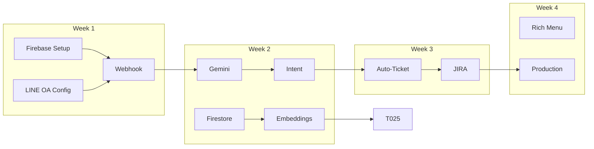

# Tasks: AI-Powered IT Support Assistant

**Branch**: `001-ai-support-assistant` | **Date**: 2026-01-07 | **Plan**: [plan.md](file:///Users/mr.phariyawit/Documents/ai-support/.specify/specs/001-ai-support-assistant/plan.md)

---

## Format: `[ID] [Priority] Description`

- **P1**: Must have for MVP
- **P2**: Important but not blocking
- **P3**: Nice to have

---

## Phase 1: Infrastructure Setup (Week 1)

### 1.1 Firebase Project Setup

- [ ] **T001** [P1] Create new Firebase project `jvc-it-support`
- [ ] **T002** [P1] Enable Cloud Functions, Firestore, Cloud Storage
- [ ] **T003** [P1] Configure Firebase environment variables:
  - `LINE_CHANNEL_SECRET`
  - `LINE_CHANNEL_ACCESS_TOKEN`
  - `JIRA_API_TOKEN`
  - `GEMINI_API_KEY`
- [ ] **T004** [P1] Setup TypeScript Cloud Functions project structure

### 1.2 LINE OA Configuration

- [ ] **T005** [P1] Get "PaPa" LINE OA credentials from LINE Developers Console
- [ ] **T006** [P1] Create LINE webhook Cloud Function
- [ ] **T007** [P1] Configure webhook URL in LINE Developers Console
- [ ] **T008** [P1] Implement signature validation
- [ ] **T009** [P2] Test basic echo response

---

## Phase 2: AI Chat Core (Week 2)

### 2.1 Gemini Integration

- [ ] **T010** [P1] Setup Gemini 2.0 Flash API client
- [ ] **T011** [P1] Create IT Support system prompt (Thai)
- [ ] **T012** [P1] Implement message processing pipeline
- [ ] **T013** [P1] Add image analysis for screenshots
- [ ] **T014** [P2] Handle conversation context (multi-turn)

### 2.2 Intent Classification

- [ ] **T015** [P1] Create intent classifier (problem report vs question vs escalation)
- [ ] **T016** [P1] Extract entities: system, category, priority
- [ ] **T017** [P2] Handle ambiguous intents with clarifying questions

---

## Phase 3: Knowledge Base (Week 2-3)

### 3.1 Data Import

- [ ] **T018** [P1] Create Firestore schema for `support_incidents` collection
- [ ] **T019** [P1] Import `FM-IT03-02 Incident Log (8).csv` to Firestore
- [ ] **T020** [P2] Process User Manual PDFs and extract text
- [ ] **T021** [P1] Create `knowledge` collection with embeddings

### 3.2 RAG Pipeline

- [ ] **T022** [P1] Setup Vertex AI text-embedding-004 for embeddings
- [ ] **T023** [P1] Create vector search index in Firestore
- [ ] **T024** [P1] Implement RAG search function
- [ ] **T025** [P1] Integrate RAG with message processor

---

## Phase 4: Incident Management (Week 3)

### 4.1 Auto-Ticket Creation

- [ ] **T026** [P1] Detect ticket creation intent
- [ ] **T027** [P1] Collect required fields via conversation
- [ ] **T028** [P1] Create incident in Firestore
- [ ] **T029** [P1] Return ticket number to user

### 4.2 JIRA Integration

- [ ] **T030** [P1] Setup JIRA API client with API token
- [ ] **T031** [P1] Implement `createJiraTicket` function
- [ ] **T032** [P1] Map priority levels (LINE → JIRA)
- [ ] **T033** [P2] Add JIRA ticket link to LINE response

---

## Phase 5: UX Polish (Week 4)

### 5.1 LINE Rich Menu

- [ ] **T034** [P2] Design Rich Menu layout (4 buttons)
- [ ] **T035** [P2] Create Rich Menu via LINE API
- [ ] **T036** [P2] Implement menu button handlers

### 5.2 Quick Replies

- [ ] **T037** [P2] Add quick reply buttons for common systems
- [ ] **T038** [P2] Add quick reply for "ส่งต่อเจ้าหน้าที่"

### 5.3 Production Deployment

- [ ] **T039** [P1] Switch from "PaPa" to "JVC Support" LINE OA
- [ ] **T040** [P1] Production environment variables
- [ ] **T041** [P1] Monitoring and alerting setup

---

## Phase 6: Web Portal (Optional - Week 5)

### 6.1 AIKMS Integration

- [ ] **T042** [P3] Add IT Support module to AIKMS frontend
- [ ] **T043** [P3] Incident list view
- [ ] **T044** [P3] Conversation history view
- [ ] **T045** [P3] Analytics dashboard

---

## Dependencies & Execution Order



---

## MVP Checklist

> [!IMPORTANT]
> **ต้องทำ tasks เหล่านี้ก่อน go-live:**

- [ ] Webhook responds to LINE messages (T006-T009)
- [ ] AI responds with relevant solutions (T010-T012, T024-T025)
- [ ] Auto-creates tickets when requested (T026-T029)
- [ ] Escalates to JIRA when AI cannot solve (T030-T032)
- [ ] Production LINE OA configured (T039-T040)

---

## Testing Checkpoints

### Checkpoint 1: Basic Echo (End of Week 1)

```
User: สวัสดี
Bot: สวัสดีค่ะ ฉันคือ AI Support Assistant...
```

### Checkpoint 2: AI Response (End of Week 2)

```
User: สมัครสมาชิกไม่สำเร็จ
Bot: [AI ตอบกลับด้วยวิธีแก้ไขจาก Knowledge Base]
```

### Checkpoint 3: Ticket Creation (End of Week 3)

```
User: เปิด ticket ปัญหา JDID ลงทะเบียนไม่ได้
Bot: สร้าง ticket เรียบร้อยแล้วค่ะ หมายเลข: IT-0001
     [ถ้า AI แก้ไม่ได้] ticket ถูกส่งต่อไปยัง JIRA แล้วค่ะ
```
