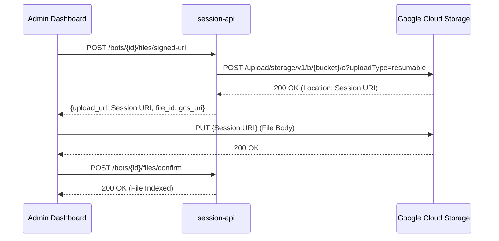

# File Upload Architecture

This document describes the architecture for uploading files to the Knowledge Base.

## Overview

Files are uploaded directly to Google Cloud Storage (GCS) using **Resumable Upload Sessions**. This bypasses the API server, removing any file size limits.

## Flow



## Key Components

### Backend (`session-api`)
- **Endpoint**: `POST /bots/{bot_id}/files/signed-url`
  - Returns a GCS Session URI for direct upload.
- **Endpoint**: `POST /bots/{bot_id}/files/confirm`
  - Confirms the upload and triggers ingestion.

### Frontend (`admin-dashboard`)
- Fetches the Session URI from the API.
- Uploads the file directly to GCS using `PUT`.
- Calls the confirm endpoint after successful upload.

### Infrastructure
- **GCS Bucket**: `ai-kms-platform-uploads`
- **CORS Config**: `infrastructure/gcs/cors-config.json`
- **Apply Script**: `infrastructure/gcs/apply-cors.sh`

## CORS Configuration

The bucket requires CORS to allow browser uploads. Apply with:

```bash
./infrastructure/gcs/apply-cors.sh
```

## Troubleshooting

| Error | Cause | Solution |
|-------|-------|----------|
| 500 on `/signed-url` | API can't reach GCS | Check service account permissions |
| CORS blocked | Origin not whitelisted | Run `apply-cors.sh` |
| File not appearing | Confirm endpoint failed | Check API logs |
